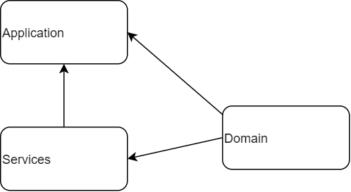

##bidder activities

The bidder activities microservice is designed to be used from the widget. It allows you to check whether a bidder is permitted to bid on a lot and to place a bid on a lot.

##MVP

The MVP provides two endpoints. 
- **auction/{id:long}/bidder/me** to allow you to check the status of a bidder on a particular auction.
- **place-bid**  which checks if you're allowed to make the requested bid then forwards it to shared service.



##Developer Notes

**Solution Structure**

The project has a simple structure with only three projects contained inside it.

- **API**: Contains the endpoints, config and startup for the project. It references both the other projects.

- **Domain**: Contains the internal representations of the business objects and logic and is referenced from the other two projects.

- **Services**: Contains the code which calls external services and the data representations required for the calls. It references the domain project.

**External Dependencies**

Bidder activities is dependent on a number of other services in order to operate.

- Shared service is required by the place bid endpoint as it forwards the place bid call to it.

- Bidder registrations CosmosDB is required to get a bidders status to determine whether or not they’re allowd to bid.

- Key Vault access is required in order to authenticate the caller. The key is setup in the TokenService terraform steps via ARM template and rotated every 18 months.

##Local Setup

To test it locally do the the following things

Install cosmos-db emulator from here https://docs.microsoft.com/en-us/azure/cosmos-db/local-emulator?tabs=ssl-netstd21

Then  create database with the name bidder-registration

Then create new container with the name bidderdata and partitionKey with partitionKey.
And Insert a record like below as it depends on existing data
```
{
    "id": "123-a_customer_123-201",
    "partitionKey": "a_customer_123-201",
    "marketplaceUniqueCode": 201,
    "tenderId": 123,
    "tenderHouseId": 1001,
    "customerId": "a_customer_123",
    "buyerId": "1245",
    "tenderRegistrationNumber": "10AC",
    "status": 1,
    "cta": "The beach was crowded with snow leopards2.\\nThere was no ice cream in the freezer, nor did they have money to go to the store.\\nGreen should have smelled more tranquil, but somehow it just tasted rotten.",
    "_rid": "XrJVAO2AZAQBAAAAAAAAAA==",
    "_self": "dbs/XrJVAA==/colls/XrJVAO2AZAQ=/docs/XrJVAO2AZAQBAAAAAAAAAA==/",
    "_etag": "\"00000000-0000-0000-557d-a54a519801d8\"",
    "_attachments": "attachments/",
    "_ts": 1650545113
}
```

Run the application in dev or development environment.


**NuGet Configuration** In order to run the project you need to make sure you have the following NuGet source registered into your Package manager console:

Nuget link - 
To do this right-click on the solution in Visual Studio -> Manage NuGet packages -> click the cog in the top right by package source and add it on the screen shown.

**Useful links:**


##Platform Integration Notes

**Client Timeouts:**

The recommended timeout for the bidder activities APIs are 6 seconds for the place bid endpoint and 2 seconds for bidder status.

**Swagger**

The API endpoint documentation can be found here , please sign-up, then request access from a member of the team.

**Headers:**

In addition to the guidelines listed here:
Required headers document link -

The x-ba-source-platform is also required.